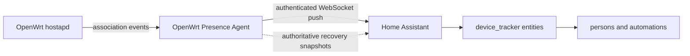

<p align="center">
  
</p>

# OpenWrt Presence for Home Assistant

**Fast, local Wi-Fi presence for Home Assistant using the OpenWrt router you
already own.**

OpenWrt Presence turns authenticated client observations from an OpenWrt router
into native Home Assistant device trackers. Association changes travel over one
persistent WebSocket connection: there is no Home Assistant polling interval,
cloud service, companion phone app, or additional BLE hardware.

> [!IMPORTANT]
> **Hardware test status:** the complete router-to-Home Assistant path has
> currently been live-tested only with a GL.iNet Flint 3 (`GL-BE9300`) running
> GL.iNet firmware 4.9.0. Flint 2 and all other router/firmware combinations
> remain unverified. A router-agent package being available for an OpenWrt
> architecture does not mean that router's wireless stack has been tested.
>
> If you try it, please
> [share your experience](https://github.com/theoabw/ha-openwrt-presence/issues/new?template=compatibility.yml).
> Successful, partial, and unsuccessful results from real systems are all
> valuable.

> [!TIP]
> **Across 110 measured Flint 3 transitions, observer-to-Home Assistant
> propagation was 6.5 ms median, 15.9 ms p99, and 17.2 ms maximum.** Every
> transition completed in under 20 ms; the larger 100-transition run stayed
> under 13 ms. These numbers measure propagation after the observer publishes
> an authoritative event, not the phone or access point's radio-detection time.
> See the
> [reproducible methodology and results](https://github.com/theoabw/openwrt-presence-agent/blob/main/docs/performance.md).

## Why OpenWrt Presence?

- **Event-driven:** valid client changes update Home Assistant immediately.
- **Local-only:** the router and Home Assistant communicate directly.
- **Purpose-built:** presence tracking without exposing router administration.
- **Multi-AP aware:** a device remains present while connected to another
  discovered BSS.
- **Failure-safe:** lost transport or stream integrity becomes `unavailable`,
  never a fabricated departure.
- **Source-specific:** multiple observers can report the same client without
  silently merging their evidence.
- **Recorder-conscious:** new trackers are disabled until explicitly enabled.

### How it compares

| Approach | Detection model | Typical trade-off |
|---|---|---|
| **OpenWrt Presence** | Router association events pushed to HA | Requires the small observer service on OpenWrt |
| Ping tracker | Periodic ICMP reachability checks | Bound by its polling interval and whether the client answers while sleeping |
| Polling-based router tracker | Periodically fetches router client tables | Updates are bound by the configured poll interval |
| GPS or BLE presence | Phone app or nearby radio observations | Complementary location evidence, but requires another app or radio path |

The table compares detection architectures; only the OpenWrt Presence row has
been measured by this project. It does not present unverified competitor
benchmarks.

This project optimizes one narrow job rather than replacing every presence
method. Home Assistant persons, groups, templates, and automations remain the
right place to combine Wi-Fi with GPS, BLE, motion, or household policy.

## How it works



The router-side
[`openwrt-presence-agent`](https://github.com/theoabw/openwrt-presence-agent)
normalizes client state behind a bounded, read-only API. This integration maps
that state literally and adds no departure delay, polling coordinator, or
cross-observer presence policy.

## What can you build with it?

- Trigger an away routine as soon as selected household devices leave Wi-Fi.
- Welcome someone home without waiting for the next network polling interval.
- Combine Wi-Fi association with GPS or BLE through a Home Assistant person.
- Drive occupancy dashboards without installing another app on every device.
- Detect trusted guest or device presence entirely inside the local network.

The current MVP targets Home Assistant 2026.7 and later and version 1 of the API
implemented by the sibling
[`openwrt-presence-agent`](https://github.com/theoabw/openwrt-presence-agent).
Compatibility is defined by protocol behavior rather than an obsolete source
commit; see the [compatibility table](docs/protocol-compatibility.md).

## Current feature set

- configures an observer through the Home Assistant UI;
- authenticates a bounded initial state snapshot;
- maintains one local WebSocket connection per config entry;
- applies valid presence-changing events immediately without polling or
  integration-side debounce;
- recovers stream integrity from a new authoritative snapshot;
- creates stable, source-specific client trackers that are disabled by default;
  and
- supports reauthentication, reconfiguration, options, and clean unload.

## Installation

Install it as a HACS custom repository:

1. In HACS, open the three-dot menu and select **Custom repositories**.
2. Add `https://github.com/theoabw/ha-openwrt-presence` with category
   **Integration**.
3. Find **OpenWrt Presence**, download a release, and restart Home Assistant.
4. Add the integration under **Settings → Devices & services**.

HACS default-store inclusion is a later stability milestone.

For manual installation, copy `custom_components/openwrt_presence` into
`/config/custom_components/openwrt_presence`, restart Home Assistant, and add
**OpenWrt Presence** under **Settings → Devices & services**.

The observer must be reachable from Home Assistant. Its default API port is
`8787`. Retrieve its bearer token on the router without pasting it into logs or
issues:

```sh
ssh root@ROUTER 'cat /etc/openwrt-presence-agent/token'
```

Enter the observer host, port, bearer token, and TLS choices in the setup form.
Do not put a scheme, path, or credentials in the host field.

## Enable the devices you want to track

Every client found in the authoritative observer snapshot receives a stable
entity-registry entry, but new trackers are disabled by default:

1. Open **Settings → Devices & services → Entities**.
2. Filter by the **OpenWrt Presence** integration.
3. Select the client trackers you want and enable them.

Home Assistant identifies these entities by both the stable observer ID and
client ID. Two observers reporting the same MAC address therefore retain
separate source tracker entities.

Home Assistant 2026.7 supports associating a connection tracker with a zone in
the entity's settings. The default associated zone is Home.

The integration option **Enable newly observed trackers by default** changes the
default for clients first discovered later. It does not override existing
entity-registry choices.

### Use a stable Wi-Fi MAC address for phones

OpenWrt Presence identifies a Wi-Fi client by the MAC address presented to the
home network. Many phones use a private or randomized MAC address for privacy.
If that address rotates, or changes after the network is forgotten or network
settings are reset, Home Assistant sees a new client rather than the same
phone. The old tracker does not automatically transfer its history, person
association, or automations to the new address.

For the most reliable phone tracking, configure the phone to use its device MAC
address **for the trusted home Wi-Fi network only**:

- On Android, open the saved home network's settings and look for **Privacy**,
  **MAC address type**, or a similarly named vendor setting, then select
  **Use device MAC**. Android exposes the randomized address in each saved
  network's settings; exact labels vary by manufacturer. See
  [Android Help](https://support.google.com/android/answer/9654714).
- On Apple devices, open the home network's Wi-Fi details and set
  **Private Wi-Fi Address** to **Off**. On recent Apple operating systems,
  **Fixed** keeps a private address stable for that network and may also work,
  but forgetting the network or resetting network settings can still create a
  new address. **Off** is the most predictable option for a deliberately
  tracked home device. See
  [Apple Support](https://support.apple.com/102509).

This is a per-network choice. Keep MAC privacy enabled on public, guest, work,
hotel, and other networks where stable identification is unnecessary. Disabling
it allows the home network and nearby observers to recognize the device's
hardware MAC, so make the trade-off only for a network you trust and control.

After changing the setting, reconnect the phone to Wi-Fi, enable the tracker
created for the new MAC address, and update any Home Assistant person or
automation that referenced the previous tracker.

## State and availability

State is intentionally literal and immediate:

| Observer state | Home Assistant |
|---|---|
| `present` | Connected in the tracker's associated zone |
| `absent` | `not_home` |
| `unknown` | `unknown` |
| Observer connection or stream integrity lost | `unavailable` |

There is no departure delay, polling interval, integration debounce, or
multi-observer aggregation. A valid presence-changing WebSocket event updates
the affected entity directly. Use a Home Assistant automation trigger with
`for:` if a particular action needs confirmation time.

After a reconnect, sequence gap, epoch change, malformed state event, or unknown
state-changing event, trackers remain unavailable until the integration accepts
a new authoritative stream snapshot.

## TLS and privacy

The reference observer currently serves HTTP by default. An unencrypted bearer
token can be read by systems able to observe that network path. Use an isolated
trusted management network or a TLS reverse proxy where appropriate. TLS
certificate verification is enabled by default whenever TLS is selected;
disabling verification is explicit and never falls back to HTTP.

The bearer token is stored only in Home Assistant config-entry data. It is not
included in entity IDs, states, attributes, logs, or URLs. Observer responses,
event messages, strings, connection lists, and client counts are bounded.

Network-presence history can reveal occupancy patterns. Consider excluding
unneeded trackers from Recorder and enable only clients that serve an automation
or dashboard purpose.

## Troubleshooting

- **Cannot connect:** verify routing from the Home Assistant host to the observer
  and confirm the host and port.
- **Invalid authentication:** retrieve the current token and use the
  integration's reauthentication flow.
- **Observer not ready:** check `GET /v1/health` and the observer logs. Home
  Assistant retries setup after the observer has an authoritative snapshot.
- **Entities are unavailable:** the WebSocket is disconnected or its event
  sequence cannot be trusted. The integration reconnects with bounded
  exponential backoff and restores availability only from a complete snapshot.
- **Client is `unknown`:** communication is working, but the observer cannot
  currently make an authoritative present/absent statement.
- **Observer moved:** use **Reconfigure** on the integration entry and supply
  the new address. The endpoint must report the same persistent observer ID.

Removing the config entry stops its stream and reconnect task and unloads its
trackers. The integration never configures the router or controls clients.

## Help test and improve the integration

Contributions are welcome. Particularly useful contributions before the first
public release include:

- results from real Home Assistant and compatible observer installations;
- focused bug fixes with regression tests;
- documentation and troubleshooting corrections;
- sanitized protocol fixtures that expose an interoperability issue; and
- accessibility and translation improvements once the corresponding workflow
  is ready.

Real-world experience is valuable even when nothing went wrong. The short
[installation and compatibility report](https://github.com/theoabw/ha-openwrt-presence/issues/new?template=compatibility.yml)
accepts successful, partial, and unsuccessful results; a brief note about what
you tried is enough.

When reporting a problem, include the Home Assistant version, observer
implementation and version, relevant TLS or proxy topology, the expected
behavior, and the smallest sanitized log excerpt that demonstrates the issue.
Never include bearer tokens, authorization headers, MAC addresses, hostnames,
raw client inventories, or diagnostic bundles containing identifying data.

For larger contributions, start with the [contribution guide](CONTRIBUTING.md)
and [protocol compatibility notes](docs/protocol-compatibility.md).

## AI-assisted development

Parts of this repository may be created or revised with the assistance of
generative AI tools. AI-produced suggestions are not authoritative. Maintainers
and contributors remain responsible for reviewing, testing, licensing,
security, privacy, provenance, and the accuracy of every change. The same
review and contribution requirements apply regardless of which tools were
used.

## Development

Create the pinned virtual environment and run the canonical local check:

```sh
python3.14 -m venv .venv
. .venv/bin/activate
python -m pip install -r requirements_test.txt
scripts/check.sh
```

CI runs the repository checks plus Hassfest and HACS validation. SemVer tags create a
checksummed manual-install ZIP and a GitHub release; see
[releases and rollback](docs/releases.md).

## Documentation

- [Protocol compatibility](docs/protocol-compatibility.md)
- [Releases and rollback](docs/releases.md)
- [Contributing](CONTRIBUTING.md)
- [Security policy](SECURITY.md)
- [Integration package notes](custom_components/openwrt_presence/README.md)
